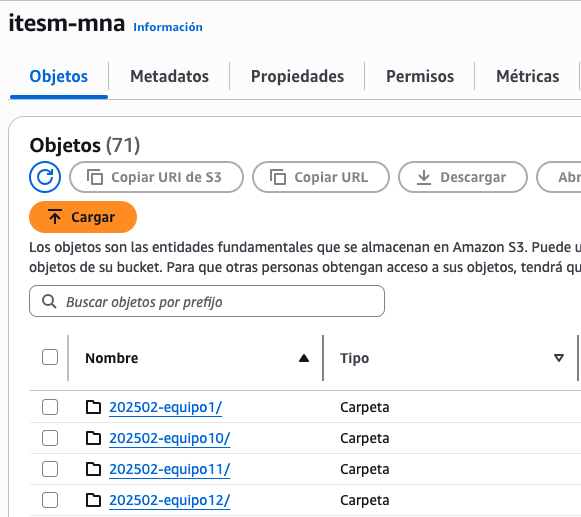
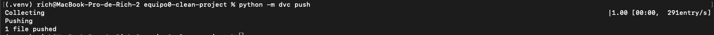
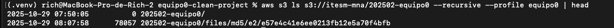

# Setup for working with AWS resources (Optional if you want to include this from Phase 2 of the Project and onwards).


In this document, we explain the necessary steps to set up your local environment to work with AWS resources (AWS S3). For this, consider that you will need the following:

## Install AWS CLI.

Setting up a local profile named `equipo{x}` where the `x` stands for your team name (e.g., for team 10, the profile name will be `equipo10`)
Ensure that you and your team have the keys provided by your TA; if not, email them to request them. These keys allow you to access AWS resources with programmatic access (Access Key ID/Secret Access Key) and won't allow you to access any other resource beyond AWS S3.

> Note: These accesses won't allow you to have access to the management console.

### AWS CLI Installation.

1. **macOS (Homebrew)**

If you do not have Homebrew, another alternative would be the following:

Download the official [pkg](https://awscli.amazonaws.com/AWSCLIV2.pkg) from AWS CLI v2 for macOS (dmg/pkg), install it, and then validate with 

```bash
aws --version.
```

1. **Windows**

From Windows (PowerShell) download and install "AWS CLI v2" for Windows (64-bit) from this [link](https://awscli.amazonaws.com/AWSCLIV2.msi) at the official AWS site.

Open a new terminal in PowerShell and execute:

```bash
aws --version
```

In both cases, t should show something like `aws-cli/2.x ...` like in the image below.


If you want to look to additional instructions, you can look at this [site](https://docs.aws.amazon.com/cli/latest/userguide/getting-started-install.html#getting-started-install-instructions)


## Setting up the AWS local profile for your team.

Each team has its own IAM user. You should get a file that contains:
- AWS_ACCESS_KEY_ID
- AWS_SECRET_ACCESS_KEY

And consider that the Region we will be working with is:
- Region = us-east-2.

The file you get from your TA looks like this:


Now, we will store it in our machine as a profile called `equipox` (for this tutorial, we will be creating that profile as equipo0)

In macOS/Linux/WSL/PowerShell, type the following:

```bash
aws configure --profile equipo0
```

It will ask the following:

> AWS Access Key ID [None]: Paste the one you have here.
> 
> AWS Secret Access Key [None]: Paste the one you have here.
> 
> Default region name [None]: type us-east-2
> 
> Default output format [None]: type json

To validate that everything is working correctly:

```bash
aws sts get-caller-identity --profile equipo0
```

> Note: You must type your team name

And you can see an Arn with `user/equipo0` like this:


If you see `AccessDenied` or empty credentials, there is a typo somewhere or something is missing.

> Note: The main bucket is named itesm-mna, and each team has its own folder under that bucket, i.e, the team "equipo1" URI will be:
> - s3://itesm-mna/202502-equipo1/




And you are only allowed to see what is in your own folder, so `equipo1` cannot see anything under `equipo2`, and so on.

You can list your folder in S3:

```bash
aws s3 ls s3://itesm-mna/202502-equipo0/ --profile equipo0
```

It should list the empty folder, and later you can use that same command to list your content. It must not fail and show an `AccessDenied`.


## Create a local environment for working locally with DVC and S3.

For this part, let's ignore the cookiecutter template or the project structure and focus only on setting up DVC with AWS S3. We will be working on a new folder, let's call it "equipo0-clean-project"

In your terminal, let's create the virtual environment.

1. **macOS/Linux/WSL**

```bash
python3 -m venv .venv
source .venv/bin/activate
```

2. **Windows**

```bash
python -m venv .venv
.\\.venv\\Scripts\\Activate.ps1
```

After the creation and activation of the virtual environment, we update pip and install DVC with S3 support.

```bash
pip install --upgrade pip
pip install "dvc[S3]"
```

We need to ensure the DVC library we use matches the one in our virtual environment.

```bash
which dvc
which python
```

In Mac/Linux, it must point to `.../equipo0-clean-project/.venv/...`

In PowerShell, we could use:

```bash
Get-Command dvc
Get-Command python
```


Remember that we need to initialize git before initializing DVC.

```bash
git init
dvc init
```


And then, we can set up our remote storage:

```bash
dvc remote add -d team_remote s3://itesm-mna/202502-equipo0
dvc remote modify team_remote region us-east-2
dvc remote modify team_remote profile equipo0
```
If you have issues with the previous commands, you can run them again, but adding `python -m` at the beggining, like this:

```bash
python -m dvc remote add -d team_remote s3://itesm-mna/202502-equipo0
python -m dvc remote modify team_remote region us-east-2
python -m dvc remote modify team_remote profile equipo0
```

If we take a look at the .dvc/config file

```bash
cat .dvc/config
```

It must look like this:

```
['remote "teamremote"']
    url = s3://itesm-mna/202502-equipo0
    region = us-east-2
    profile = equipo1
```

> The URL points to the bucket itesm-mna and to the team prefix `202502-equipo0`.
> The profile is the name of the profile we set up using aws configure (equipo0).
> Region must be `us-east-2`.

We can commit everything as we have seen before

```bash
git add .
git commit -m "feat: Initializing DVC and setting up the remote storage in S3"
```

## Upload data to the remote storage at AWS S3.

With this, we can foster collaboration between the team members. You take the file you were working with and add it to your folder.

Then, you start tracking it with DVC:

```bash
python -m dvc add data/raw/WineQT.csv
```

You commit your changes:

```bash
git add data/raw/WineQT.csv.dvc data/raw/.gitignore
git commit -m "Track WineQT.csv with DVC"
```


And finally, we send it to the remote storage, but consider that in this scenario, we need to use the full command:

```bash
python -m dvc push
```



We can review that everything was correctly done in AWS S3 with the profile we established with this command:

```bash
aws s3 ls s3://itesm-mna/202502-equipo0 --recursive --profile equipo0 | head
```



Which is the same we have in the management console


